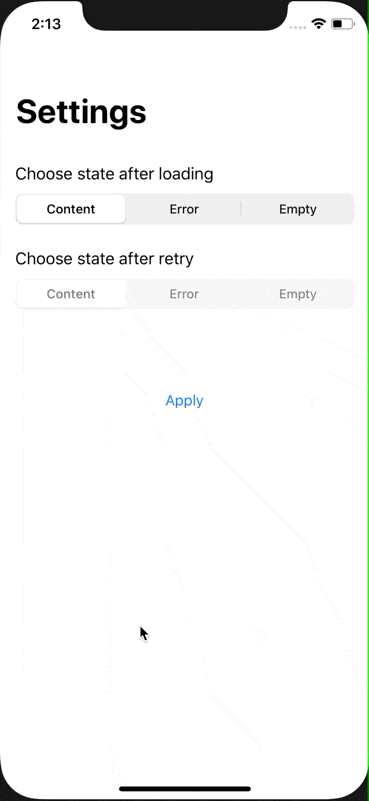

# StateDispatcher
[](http://cocoapods.org/pods/StateDispatcher)
[](https://github.com/Carthage/Carthage)
[](https://github.com/AntonLisovoy/StateDispatcher/blob/master/LICENSE.md)
[](http://cocoapods.org/pods/StateDispatcher)
[](https://developer.apple.com/swift/)


## Intoduction
A simple state machine to show different view controllers using children view controllers.



## Usage
### Basic
```swift
import StateDispatcher
```

Your container view controller, that needs to be state machinable, should confirm `StateMachinable`
```swift
class ContentStateMachineViewController: UIViewController, StateMachinable {
  var stateProvider: ContentStateProvider?
  var stateControllersProvider: ContentStateControllersProvider?

  func changeTo(state: ContentStateMachine) {
    ...
  }
  ...
}
```

See demo project for more information.

## Requirements
`StateDispatcher` written in Swift 5.0. Compatible with iOS 11.0+

## Installation

### Cocoapods

StateDispatcher is available through [CocoaPods](http://cocoapods.org). To install
it, simply add the following line to your Podfile:

```ruby
pod 'StateDispatcher'
```
### Carthage
```
github "AntonLisovoy/StateDispatcher"
```

## Contributing
Pull requests are welcome. For major changes, please open an issue first to discuss what you would like to change.

## Author
[Anton Lisovoy](https://twitter.com/AntonLisovoy)

## License
StateDispatcher is available under the MIT license. See the [LICENSE.md](LICENSE.md) file for more info.
